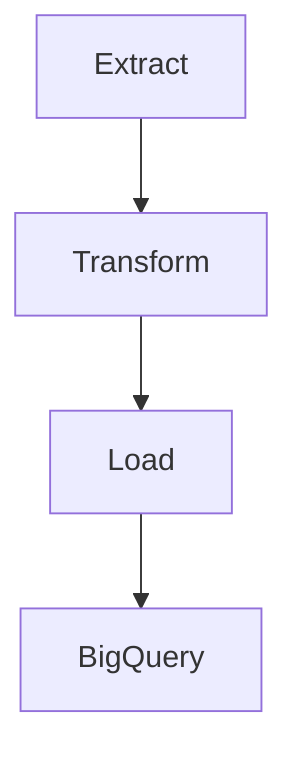

# TikTok Trends ETL – Pipeline de Dados com Google Cloud Platform + BigQuery

Projeto de pipeline de dados que coleta, transforma e analisa vídeos do TikTok a partir de hashtags, usando Python e Google Cloud Platform (GCP).

---

## Objetivo

Desenvolver um pipeline ETL completo para coleta de dados públicos do TikTok, com foco em análise de tendências, engajamento e perfis influentes. Idealizado como parte da minha transição de carreira de fullstack para data science e inspiado no projeto anterior que fiz para o mestrado da minha esposa.

---

## Tecnologias utilizadas

- Python
- Pandas, Matplotlib, Seaborn
- Google BigQuery
- Google Cloud Storage (futuramente)
- Jupyter Notebook
- API pública do TikTok (via projeto Bellingcat e Teather)
- Autenticação via Service Account (GCP)

---

## Estrutura do Pipeline ETL



- **Extract** → Coleta dados de vídeos por hashtag no TikTok
- **Transform** → Limpa, normaliza e enriquece os dados
- **Load** → Envia os dados para uma tabela no BigQuery
- **Analyze** → Notebooks e visualizações são gerados a partir dos dados

---

## Estrutura do Projeto

```
tiktok-trends-etl/
│
├── extract/               # Coleta de dados
├── transform/             # Limpeza e padronização
├── load/                  # Upload para BigQuery
├── notebooks/             # Análise de dados
├── data/                  # Dados brutos e processados
└── run_etl.py             # Pipeline automatizado local
```

---

## Como rodar o projeto localmente

```bash
# Instale as dependências
pip install -r requirements.txt

# Execute o pipeline completo
python3 run_etl.py
```

---

## Resultados e Insights

O notebook de análise `analysis.ipynb` inclui:

- Correlação entre visualizações e curtidas
- Top 10 hashtags mais frequentes
- Cálculo de engajamento por vídeo

Você pode visualizá-lo na sua IDE de preferência ou [Google Colab](https://colab.research.google.com/) com sua chave de serviço.

---

## Segurança

Esse projeto usa uma `gcp_key.json` (não incluída no repositório) para se conectar ao BigQuery com autenticação segura via service account.

---

## Futuras melhorias

- [ ] Deploy automatizado com Cloud Scheduler e Cloud Functions
- [ ] Dashboard público via Looker Studio
- [ ] Coleta contínua de dados semanais

---

## Autor

**Giovanni Della Déa**  
Desenvolvedor em transição para ciência de dados  
📫 [LinkedIn](https://www.linkedin.com/in/giodelladea) • [GitHub](https://github.com/giossaurus)

---

## Disclaimer

Os dados utilizados neste projeto são públicos e acessados de forma ética, exclusivamente para fins educacionais e analíticos.
